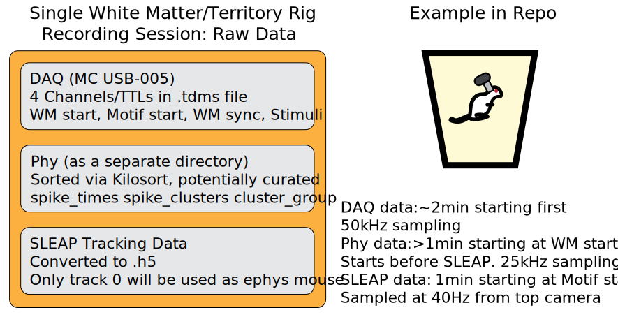

# White Matter Demo
This demo is for a single, 60sec recording of lateral septum while the mouse is in its homecage (details below). The resulting figure shows the various streams of DAQ, behavior, and spike data and how they are imported and processed via FalknerEphys modules.
## Organizing the data
All White Matter recordings should be organized in a single folder containing three data streams with required files. There should be an .h5 file for the DAQ signals (converted from raw .tdms files), an .h5 file for proofread SLEAP output, and a folder 'phy' which includes Kilosort/Phy output. This demo can be run on any recording session that fits the standard formating

## Running the demo
`from falknerephys.demos import wm_import_demo` 
`wm_import_demo() # to run example data` 
or 
`wm_import_demo(path) # to run on your own recording` 
where path is a folder containing your DAQ/SLEAP/Phy output
## Output using example data

